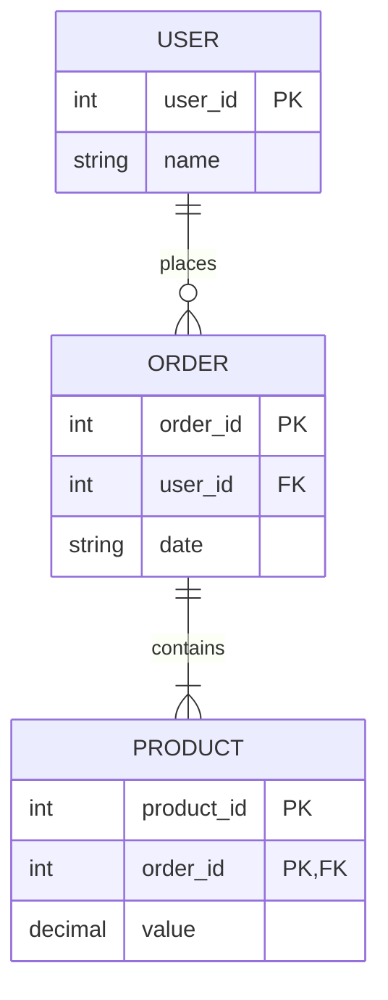

## Diagrama ER

```mermaid
erDiagram
    USER {
        int user_id PK
        string name
    }

    ORDER {
        int order_id PK
        int user_id FK
        string date
    }

    PRODUCT {
        int product_id PK
        int order_id PK, FK
        decimal value
    }

    USER ||--o{ ORDER : places
    ORDER ||--|{ PRODUCT : contains 
```
