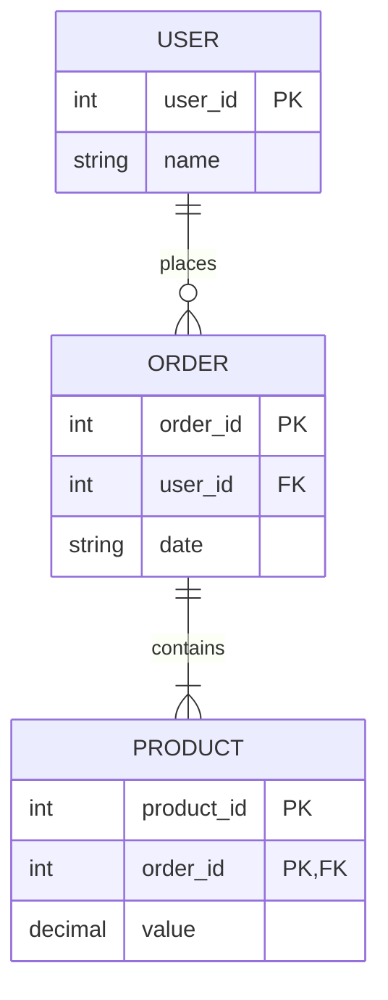

# Diagrama de Modelo de Entidade-Relacionamento (ER)

O diagrama a seguir ilustra o Modelo de Entidade-Relacionamento (ER) para um sistema que gerencia informações de usuários, pedidos e produtos. A representação visual destaca as entidades envolvidas e os relacionamentos entre elas, oferecendo uma visão clara da estrutura subjacente dos dados.

## Entidades

### 1. Usuário (USER)
   - **user_id (PK):** Identificador único do usuário.
   - **name:** Nome do usuário.

### 2. Pedido (ORDER)
   - **order_id (PK):** Identificador único do pedido.
   - **user_id (FK):** Chave estrangeira que se relaciona com a entidade "Usuário."
   - **date:** Data do pedido.

### 3. Produto (PRODUCT)
   - **product_id (PK):** Identificador único do produto.
   - **order_id (PK, FK):** Chave estrangeira que se relaciona com a entidade "Pedido."
   - **value:** Valor do produto.

## Relacionamentos

- A entidade "Usuário" (USER) está relacionada com a entidade "Pedido" (ORDER) através da relação "places." Isso indica que um usuário pode realizar vários pedidos, mas cada pedido é associado a um único usuário.

- A entidade "Pedido" (ORDER) está relacionada com a entidade "Produto" (PRODUCT) através da relação "contains." Isso destaca que um pedido pode conter vários produtos, mas cada produto pertence a um único pedido.

Este modelo ER é uma ferramenta valiosa para compreender e visualizar a estrutura de dados do sistema. Ele auxilia no design, desenvolvimento e manutenção de sistemas de banco de dados, proporcionando insights cruciais para tomar decisões sobre a funcionalidade da aplicação.
