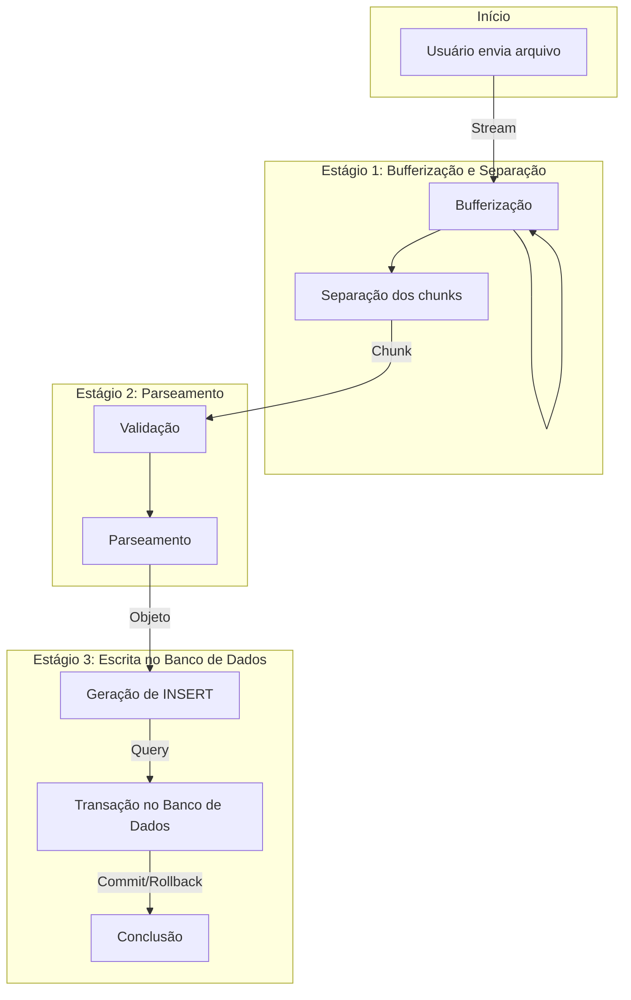

# Pipeline de Processamento de Stream em Node.js

O diagrama a seguir ilustra um pipeline de processamento de Stream em Node.js, projetado para lidar com o envio de arquivos pelo usuário e a subsequente inserção de dados no banco de dados PostgreSQL. Este pipeline é composto por três estágios distintos, cada um desempenhando um papel crucial na transformação e persistência dos dados.

## Estágio 1: Bufferização e Separação

Nesta fase inicial, o usuário inicia o fluxo enviando um arquivo como uma Stream (A). O primeiro estágio de transformação é responsável pela Bufferização e Separação dos chunks da Stream. O processo de Bufferização coleta os dados da Stream, enquanto o passo de Separação divide esses chunks com base em um separador especificado (Buff --> Splitting).

## Estágio 2: Parseamento

Os chunks resultantes do estágio anterior são submetidos ao segundo estágio, onde ocorre o Parseamento. Aqui, os chunks são validados (Validation) e transformados em objetos manipuláveis por meio de um processo de parseamento (Splitting --> Validation --> Parser).

## Estágio 3: Escrita no Banco de Dados

No terceiro e último estágio, os objetos resultantes do parseamento são utilizados para gerar consultas de inserção (Geração de INSERT). Essas consultas são encapsuladas em uma transação no banco de dados PostgreSQL (Parser --> G). A transação pode ser confirmada (Commit) se todas as operações forem bem-sucedidas ou revertida (Rollback) em caso de falha (G --> H).

O pipeline é concluído com a transação no banco de dados, representando a persistência bem-sucedida ou um rollback em caso de erro (H).

Este fluxo de processamento sob demanda permite uma manipulação eficiente de grandes conjuntos de dados, garantindo que o sistema seja resiliente, escalável e capaz de lidar com arquivos de entrada diversificados.
